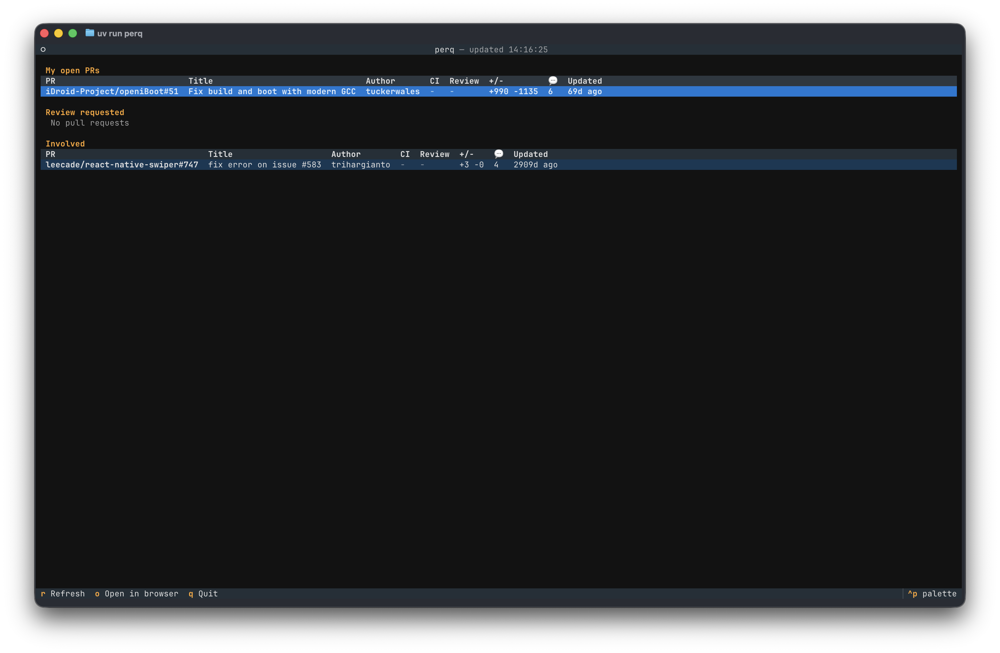
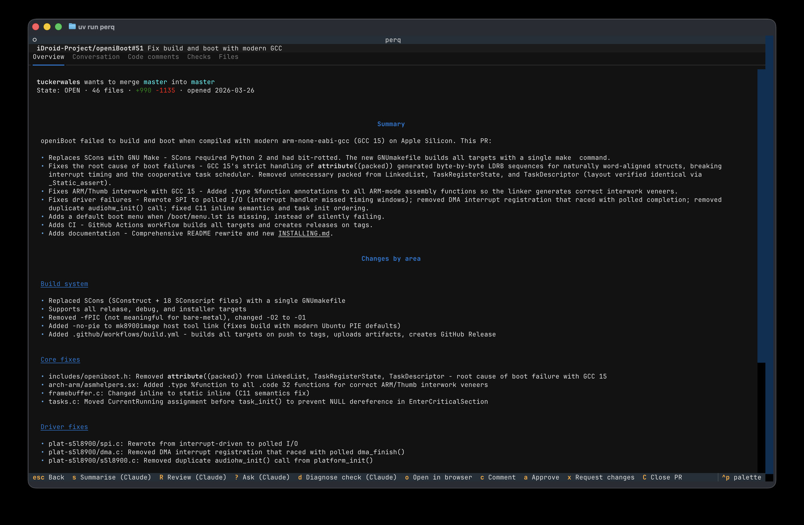
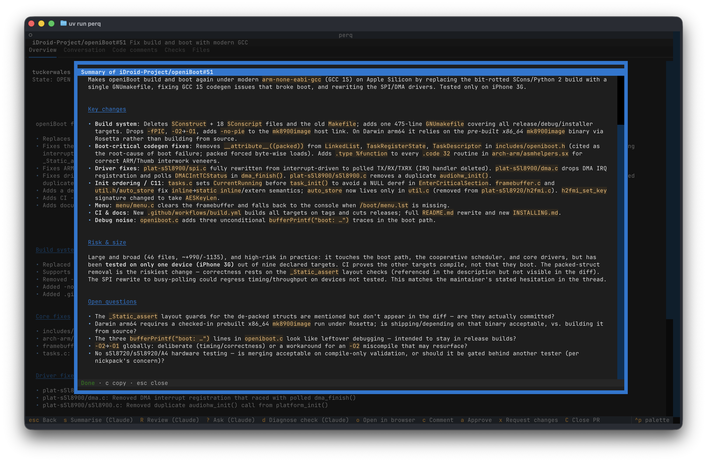
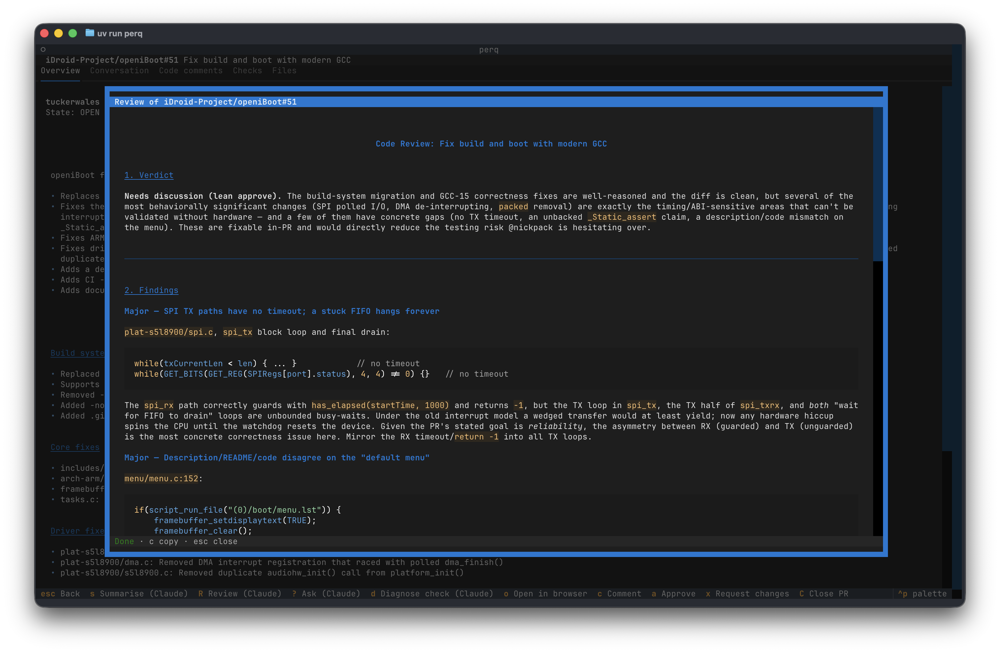

# perq

A terminal dashboard for your GitHub pull requests, built with [Textual](https://textual.textualize.io/). Browse the PRs you've opened and the ones you're involved in, drill into details, conversation, code-review comments and CI checks — and ask [Claude Code](https://claude.com/claude-code) to summarise a PR, review it, or diagnose a failing check, streamed live into the TUI. The dashboard notifies you when something changes: CI breaks or recovers, a review lands, or someone asks for yours.

<p align="center">
  
  <br>
  <em>The dashboard — your open PRs, ones awaiting your review, and others you're involved in.</em>
</p>

## Requirements

- Python 3.12+ and [uv](https://docs.astral.sh/uv/)
- [`gh`](https://cli.github.com/) logged in (`gh auth login`) — perq uses `gh auth token` for API access (falls back to `$GITHUB_TOKEN`)
- The `claude` CLI on your PATH (for summaries and reviews)

## Run

```sh
uv run perq
```

## Dashboard

Three sections, refreshed from a single GraphQL query:

- **My open PRs** — open PRs you authored
- **Review requested** — open PRs where your review is requested
- **Involved** — other open PRs you've commented on, been assigned to, or been mentioned in

The dashboard auto-refreshes every 60 seconds (silently, keeping your cursor position) and whenever you come back from a PR. Set `PERQ_REFRESH` to change the interval in seconds, or `PERQ_REFRESH=0` to disable. The header shows the last refresh time.

| Key | Action |
| --- | --- |
| `enter` | Open the selected PR |
| `r` | Refresh |
| `o` | Open PR in browser |
| `q` | Quit |

### Notifications

Each refresh is compared against the previous one, and meaningful changes raise a toast: CI failing or going green on your PRs, a PR being approved or getting changes requested, new comments, and new review requests. Only transitions fire — startup is silent, and a burst of more than five events collapses into a single summary.

On macOS, the same events also raise a desktop notification when the terminal is unfocused. Set `PERQ_DESKTOP_NOTIFY=0` to turn desktop notifications off.

## Command palette

Press `ctrl+p` to open the command palette. Paste a GitHub PR URL (`https://github.com/owner/repo/pull/123`) or type a shorthand reference (`owner/repo#123`) to open any PR — including ones not on your dashboard. You can also fuzzy-search the PRs currently on the dashboard by repo or title.

## PR detail

Five tabs: **Overview** (metadata + description, with a one-line checks summary), **Conversation** (comments and review summaries), **Code comments** (review threads with their diff hunks), **Checks** (individual CI check runs and statuses), and **Files** (the full diff).

<p align="center">
  
  <br>
  <em>The PR detail view — the Overview tab with metadata and the rendered description.</em>
</p>

| Key | Action |
| --- | --- |
| `s` | Summarise the PR with Claude Code |
| `R` | Review the PR with Claude Code |
| `d` | Diagnose the selected failing check with Claude Code |
| `o` | Open PR in browser |
| `escape` | Back to dashboard |

Claude output streams into a modal as it's generated. It is local-only and never posted to GitHub. Press `c` to copy the output to your clipboard, `escape` to cancel/close.

<p align="center">
  
  <br>
  <em>Press <code>s</code> for a Claude summary — key changes, risk &amp; size, and open questions.</em>
</p>

<p align="center">
  
  <br>
  <em>Press <code>R</code> for a Claude review — a verdict followed by detailed findings.</em>
</p>

### Checks

The Checks tab lists every check run on the PR's latest commit. Press `enter` on a check to open it in the browser. On a failed GitHub Actions check, press `d` to fetch the job's logs and have Claude diagnose it: what failed, the root cause, a suggested fix, and whether it looks flaky or real. External checks (e.g. third-party CI reported via the status API) have no fetchable logs, so they open in the browser instead. Logs for runs older than GitHub's retention window (90 days) are no longer available.

## Development

```sh
uv run pytest               # tests
uv run python -m perq.github   # smoke-test the GitHub client against live data
uv run textual run --dev perq.app:PerqApp   # run with textual devtools
```
